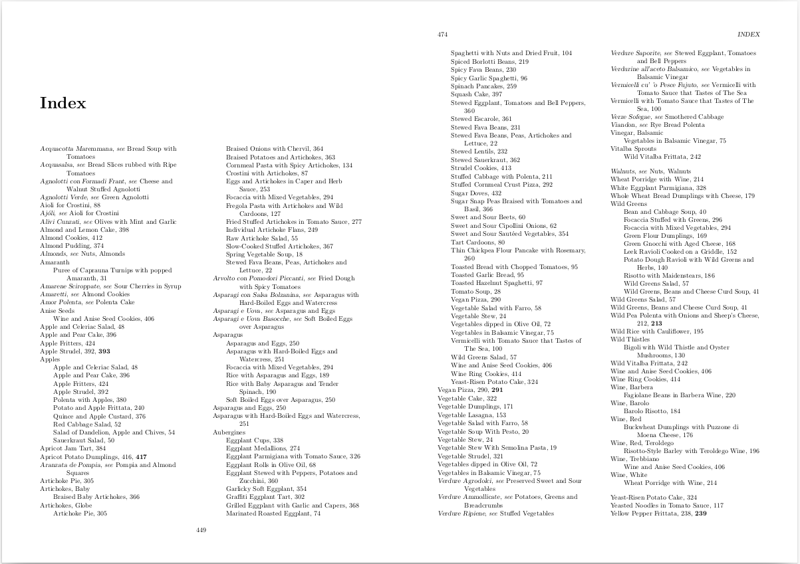

# An index for the book 'Vegetariano'

I have the book ['Vegetariano'](https://www.rizzoliusa.com/book/9780847861811/), which lists
400 Vegetarian Italian recipes from the [Italian Slow Food Movement](https://www.slowfoodeditore.it/it/).
It's a great book, with some fantastic recipes, but it has a major flaw - there is no real index!
There is an index of sorts, but it only covers the recipe names, and is ordered by region.
Not really useful if you can only remember part of a title or a specific ingredient.

Thus, I put together my own index, and am sharing it here.

This repository generates a printable index for the book. I basically read through the book and typed
in all the relevant interesting data - sections, recipe names and important ingredients, and used
[LaTeX indexing methods](https://en.wikibooks.org/wiki/LaTeX/Indexing) to generate the final index.

> **NOTE:** This is *not* a copy of the book, and it will not tell you how to cook any of the recipes
> or give you their full ingredients lists.
> It is purely an index of the recipes and their key ingredients. You will need to buy a copy of the
> book to make use of this index.

I hope somebody else might find this useful, and make the book much easier to use on a daily basis.

## The final result

The final results are PDF files. For convinience they are attached in the 'release' section of this
repository. There are effectively two useful PDFs:

| Name | Description |
| ------ | ------ |
| `index.pdf` | Plain A4 index |
| `index_booklet.pdf` | A5 booklet form index on A4 sheets |

The `index_booklet.pdf` is the nicest to print and fold if you can as it then forms an A5 index
booklet you can keep alongside your book. You need to print it double sided on an A4 printer with
'flip on short edge' enabled.

## Sample

Below is a sample of how the index looks. This is taken from one page of the booklet form, so shows
two non-consecutive pages, which works out once the booklet is folded together.



## The 'internals'

Internally the index data is entered using a number of `LaTeX` commands (macros), that then use the
data to invoke the correct `LaTeX` indexing commands. Below is a summary and then descriptions of
these commands.

| Command | Description |
| ------ | ------ |
| **category**{*Category*} |  Set which category following recipes fall into |
| **recipe**{*RecipeTitle*} |  Define a recipe start |
| **recipestart**{*RecipeTitle*} |  Define a multi-page recipe start |
| **recipestop**{*RecipeTitle*} |  Define a multi-page recipe stop |
| **italianrecipe**{*ItalianTitle*} | Define the current recipe Italian name |
| **italianrecipealtsort**{*RealItalianName*, *SortName*} | Define Italian name with alternative sort name |
| **photo**{*RecipeTitle*} | Define photo of a recipe |
| **refcurrentrecipe**{*AlternativeRecipeName*} | Reference an alternative name to the current recipe |
| **refcurrentrecipealtsort**{*RealRecipeName*, *SortName*} | Alternative recipe name with alternative sort name |
| **region**{*RegionName*} | Define the region for the current recipe |
| **ingredient**{*Ingredient*} |  Define an ingredient for the current recipe |
| **ingredientredundant**{*Ingredient*} |  Define an ingredient that is actually superfluous to the index |
| **vegan** |  Note the current recipe is Vegan |

### category

> **category**{*Category*}

Most sections of the book will start with a `category{}` command. It sets the category that the
following recipes will be added to, until a new `category{}` is set. Internally the name of the
current category is stored withing a command `Vcurrentcategory`.

### recipe

> **recipe**{*RecipeTitle*}

Starts a new recipe entry. This is the English recipe name. Optionally an Italian recipe name can then
be added (see `italianrecipe{}`). Internally the name of the current recipe is stored in the command
`Vcurrentrecipe`.

### recipestart

> **recipestart**{*RecipeTitle*}

For recipes that span multiple pages (there are a few, but not many in the book), `recipestart{}` is
used to mark the starting page of the recipe, and `recipestop{} the end. The argument is the English
recipe name.

### recipestop

> **recipestop**{*RecipeTitle*}

The matching stop call to `recipiestart{}`.

### italianrecipe

> **italianrecipe**{*ItalianTitle*}

Registers an Italian recipe name to the current English recipe name. Will generate a '`see`' entry
in the index.

### italianrecipealtsort

> **italianrecipealtsort**{*RealItalianName*, *SortName*}

Allows an Italian recipe title to be entered with an alternative sort name to change its position in
the index. Can be useful when a recipe name starts with a non-alphabetic character for instance.

### photo

> **photo**{*RecipeTitle*}

Notes a photo page for the current recipe. Generates a **bold** page reference in the index for the
appropriate recipe name. A little sadly, it only generates that bold reference on the top level
recipe reference, and not any sub-section or ingredient references.

### refcurrentrecipe

> **refcurrentrecipe**{*AlternativeRecipeName*}

Can be used to generate a '`see`' reference to the current English recipe, which can be useful when
there is a 'buried' recipe. This happens quite often in the Pasta section for instance when there
are hidden recipes for making the pasta itself. Also for things like Mayonaise an Aioli etc.

### refcurrentrecipealtsort

> **refcurrentrecipealtsort**{*RealRecipeName*, *SortName*}

Like `refcurrentrecipe`, but with the ability to offer an alternative sort order name.

### region

> **region**{*RegionName*}

Denotes the region of the current recipe. Not currently used in generating the index, and the book
does contain a per-region index. If necessary could be used to generate a region/section/ingredient
index etc. if wanted.

### ingredient

> **ingredient**{*Ingredient*}

Defines an ingredient of the current recipe. The current recipe will then be referenced under that
ingredient in the index.

### ingredientredundant

> **ingredientredundant**{*Ingredient*}

Like `ingredient`, but the ingredient will not be added to the index. This is useful for recipes where
the ingredient is also the first word of the recipe name, and is the only recipe in the index (or all
recipes with this ingredient in the index) match that pattern. If we do not drop the reference then we
get three consecutive index entries where just one will do the same job. For instance, in the made up
example below of Egg Salad. If we did not drop the `Egg`, we would get:

    Egg
        Egg Salad
    Egg Salad

If we drop the `Egg` with `ingredientredundant`, then we get a single `Egg Salad` entry, which does not
lose anything in the index.

### vegan

> **vegan**

Denotes the current recipe as being vegan. This adds the recipe to an extra `vegan` sub-section in the
index. Many of the recipes are vegan, so it is useful to have a single place in the index that allows
you to look them all up.

## An example

Below is the code for the first recipe in the book. This shows the basic usage pattern. Be aware that
not every recipe has a `category{}` call - mostly there is one `category{}` call at the top of each
section file, and that then covers all recipes in that section.

```latex
\category{Soups}
\recipe{Spring Vegetable Soup}
\italianrecipe{Bazzoffia}
\region{Lazio}
\ingredient{Artichokes, Globe}
\ingredient{Chard}
\ingredient{Beans, Fava}
```

## Decisions made about the index

Some decisions were made when constructing the index that you might want to be aware of. For instance,
some ingredients were not added as they are just too common (such as Parmesan, which occurs in many
of the recipes), but sometimes they are added when they are deemed a critical part of a recipe.

Some ingredient categories are always grouped by category first, for instance, all the nuts are written
like `Nuts, Walnuts`. This helps keep uniformity in the index. The same applies for instance for
`Cheese`, `Chillis` and `Beans`, as well as probably others.

There is also a `seealso.tex` file that is used to make other crossreferences, in particular for
some ingredients. For instance, it is used to cross reference `Broad Beans` to `Beans, Fava`, as well
as many others.

## Bug reports, improvements etc.

If you find a mistake, feel free to report it using the 'Issue' method here on GitHub. Even better, if
you would like to submit a Pull Request with the changes, that would be great. Feel free to also ask
questions, or even request features. I can't promise I will be able to fulfull any feature requests, but
at a minimum I might have suggestions about how to go about it or why I didn't do it in the first place.

## Building

The index is built using a `Makefile`. There are only two make targets:

  `all`: The default. Will build the main index pdf files.
  `printable`: Will build the booklet form pdf.

Thus, if developing or if you don't need the booklet, just use `make`. Once you are happy with the
results, if you then need the booklet form, use `make printable`.

The prerequisites are `LaTeX` and `psutils` (I build on Linux btw). I don't think I used any other
specific packages. You can probably build the `LaTeX` files in any `LaTeX` system of your choice and
don't have to use the `Makefile`.

## License

Let's start by saying, the book and all its contents are obviously copyright of the authors and
publishers.

I'm releasing this index data under the
[Creative Commons CC-BY-SA 4.0](https://creativecommons.org/licenses/by-sa/4.0/)
license.
